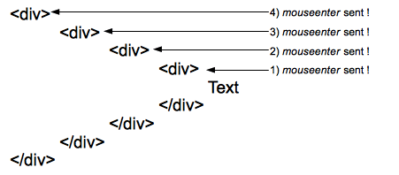
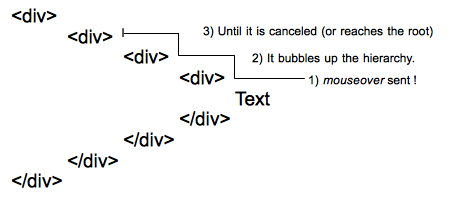

{{APIRef}}

O evento `mouseenter` é disparado quando um dispositivo de apontamento (geralmente um mouse) se move sobre um elemento (para dentro do mesmo).

Similar ao {{event('mouseover')}}, ele se diferencia no fato de que não ocorre a fase [bubble](/pt-BR/docs/Web/API/Event/bubbles) e não é disparado quando o cursor / apontador mover-se do espaço físico de um de seus descendentes para o seu próprio espaço físico.

Um evento `mouseenter` é enviado para cada elemento da hierarquia ao entrar neles. Aqui 4 eventos são enviados aos quatro elementos da hierarquia quando o cursor / apontador chega no Text.Um único evento `mouseover` é enviado ao elemento de maior profundidade na árvore DOM, a partir do qual ocorre a fase bubble e o mesmo percorre subindo na hierarquia dos elementos até que seja cancelado por um _handler_ ou alcance a raíz da árvore.

De acordo com a profundidade da hierarquia, a quantidade de eventos `mouseenter` disparados pode se tornar muito grande e causar problemas de performance significativos. Nestes casos é melhor escutar por eventos mouseover.

Combinado ao comportamento do seu evento simétrico, `mouseleave`, o evento DOM `mouseenter` age de modo bastante similar à pseudo-classe CSS {{cssxref(':hover')}}.

## Informações Gerais

- Especificação
  - : [DOM L3](https://www.w3.org/TR/DOM-Level-3-Events/#event-type-mouseenter)
- Interface
  - : {{domxref('MouseEvent')}}
- Sincronismo
  - : Síncrono
- Fase Bubble
  - : Não
- Cancelável
  - : Não
- Target
  - : Element
- Ação Padrão
  - : Nenhuma

## Propriedades

| Property                           | Type                       | Description                                                                                                                                                                                                                                                                                                                                                                                                             |
| ---------------------------------- | -------------------------- | ----------------------------------------------------------------------------------------------------------------------------------------------------------------------------------------------------------------------------------------------------------------------------------------------------------------------------------------------------------------------------------------------------------------------- |
| `target` {{readonlyInline}}        | {{domxref("EventTarget")}} | The event target (the topmost target in the DOM tree).                                                                                                                                                                                                                                                                                                                                                                  |
| `type` {{readonlyInline}}          | {{domxref("DOMString")}}   | The type of event.                                                                                                                                                                                                                                                                                                                                                                                                      |
| `bubbles` {{readonlyInline}}       | Boolean                    | Whether the event normally bubbles or not                                                                                                                                                                                                                                                                                                                                                                               |
| `cancelable` {{readonlyInline}}    | `Boolean`                  | Whether the event is cancellable or not?                                                                                                                                                                                                                                                                                                                                                                                |
| `view` {{readonlyInline}}          | {{domxref("WindowProxy")}} | {{domxref("document.defaultView")}} (`window` of the document)                                                                                                                                                                                                                                                                                                                                                          |
| `detail` {{readonlyInline}}        | `long` (`float`)           | 0.                                                                                                                                                                                                                                                                                                                                                                                                                      |
| `currentTarget` {{readonlyInline}} | {{domxref("EventTarget")}} | The node that had the event listener attached.                                                                                                                                                                                                                                                                                                                                                                          |
| `relatedTarget` {{readonlyInline}} | {{domxref("EventTarget")}} | For `mouseover`, `mouseout`, `mouseenter` and `mouseleave` events: the target of the complementary event (the `mouseleave` target in the case of a `mouseenter` event). `null` otherwise.                                                                                                                                                                                                                               |
| `screenX` {{readonlyInline}}       | long                       | The X coordinate of the mouse pointer in global (screen) coordinates.                                                                                                                                                                                                                                                                                                                                                   |
| `screenY` {{readonlyInline}}       | long                       | The Y coordinate of the mouse pointer in global (screen) coordinates.                                                                                                                                                                                                                                                                                                                                                   |
| `clientX` {{readonlyInline}}       | long                       | The X coordinate of the mouse pointer in local (DOM content) coordinates.                                                                                                                                                                                                                                                                                                                                               |
| `clientY` {{readonlyInline}}       | long                       | The Y coordinate of the mouse pointer in local (DOM content) coordinates.                                                                                                                                                                                                                                                                                                                                               |
| `button` {{readonlyInline}}        | unsigned short             | The button number that was pressed when the mouse event was fired: Left button=0, middle button=1 (if present), right button=2. For mice configured for left handed use in which the button actions are reversed the values are instead read from right to left.                                                                                                                                                        |
| `buttons` {{readonlyInline}}       | unsigned short             | The buttons being pressed when the mouse event was fired: Left button=1, Right button=2, Middle (wheel) button=4, 4th button (typically, "Browser Back" button)=8, 5th button (typically, "Browser Forward" button)=16. If two or more buttons are pressed, returns the logical sum of the values. E.g., if Left button and Right button are pressed, returns 3 (=1 \| 2). [More info](/pt-BR/docs/Web/API/MouseEvent). |
| `mozPressure` {{readonlyInline}}   | float                      | The amount of pressure applied to a touch or tabdevice when generating the event; this value ranges between 0.0 (minimum pressure) and 1.0 (maximum pressure).                                                                                                                                                                                                                                                          |
| `ctrlKey` {{readonlyInline}}       | boolean                    | `true` if the control key was down when the event was fired. `false` otherwise.                                                                                                                                                                                                                                                                                                                                         |
| `shiftKey` {{readonlyInline}}      | boolean                    | `true` if the shift key was down when the event was fired. `false` otherwise.                                                                                                                                                                                                                                                                                                                                           |
| `altKey` {{readonlyInline}}        | boolean                    | `true` if the alt key was down when the event was fired. `false` otherwise.                                                                                                                                                                                                                                                                                                                                             |
| `metaKey` {{readonlyInline}}       | boolean                    | `true` if the meta key was down when the event was fired. `false` otherwise.                                                                                                                                                                                                                                                                                                                                            |

## Examples

The [`mouseover`](/pt-BR/docs/Web/Events/mouseover#Example) documentation has an example illustrating the difference between `mouseover` and `mouseenter`.

The following example illustrates how to use `mouseover` to simulate the principle of event delegation for the mouseenter event.

```html
<ul id="test">
  <li>
    <ul class="enter-sensitive">
      <li>item 1-1</li>
      <li>item 1-2</li>
    </ul>
  </li>
  <li>
    <ul class="enter-sensitive">
      <li>item 2-1</li>
      <li>item 2-2</li>
    </ul>
  </li>
</ul>

<script>
  var delegationSelector = ".enter-sensitive";

  document.getElementById("test").addEventListener(
    "mouseover",
    function (event) {
      var target = event.target,
        related = event.relatedTarget,
        match;

      // search for a parent node matching the delegation selector
      while (
        target &&
        target != document &&
        !(match = matches(target, delegationSelector))
      ) {
        target = target.parentNode;
      }

      // exit if no matching node has been found
      if (!match) {
        return;
      }

      // loop through the parent of the related target to make sure that it's not a child of the target
      while (related && related != target && related != document) {
        related = related.parentNode;
      }

      // exit if this is the case
      if (related == target) {
        return;
      }

      // the "delegated mouseenter" handler can now be executed
      // change the color of the text
      target.style.color = "orange";
      // reset the color after a small amount of time
      setTimeout(function () {
        target.style.color = "";
      }, 500);
    },
    false,
  );

  // function used to check if a DOM element matches a given selector
  // the following code can be replaced by this IE8 compatible function: https://gist.github.com/2851541
  function matches(elem, selector) {
    // the matchesSelector is prefixed in most (if not all) browsers
    return elem.matchesSelector(selector);
  }
</script>
```

## Especificações

{{Specifications}}

## Compatibilidade com navegadores

{{Compat}}

## See also

- {{Event("mousedown")}}
- {{Event("mouseup")}}
- {{Event("mousemove")}}
- {{Event("click")}}
- {{Event("dblclick")}}
- {{Event("mouseover")}}
- {{Event("mouseout")}}
- {{Event("mouseenter")}}
- {{Event("mouseleave")}}
- {{Event("contextmenu")}}
